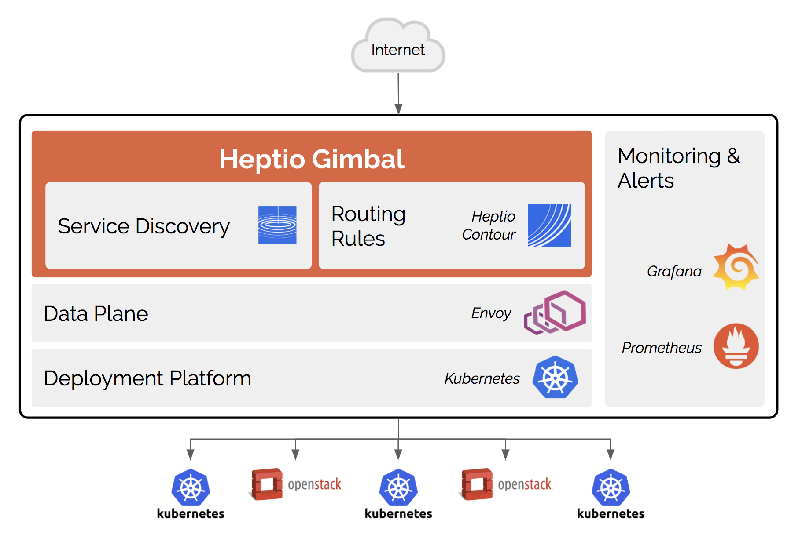
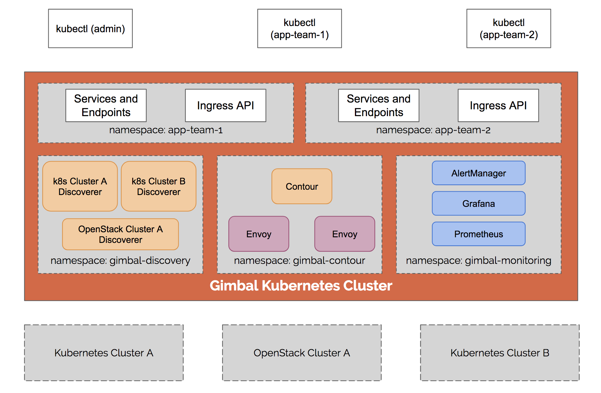
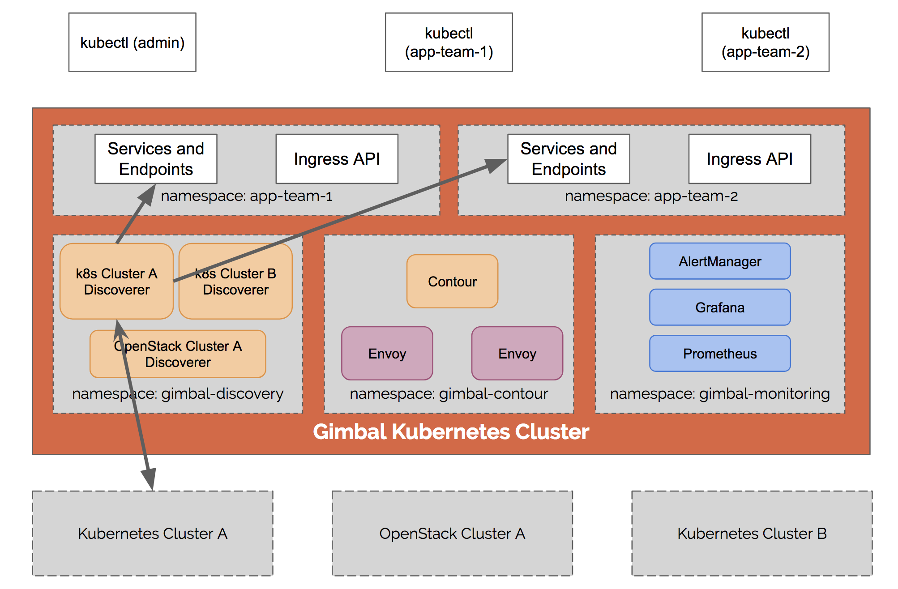
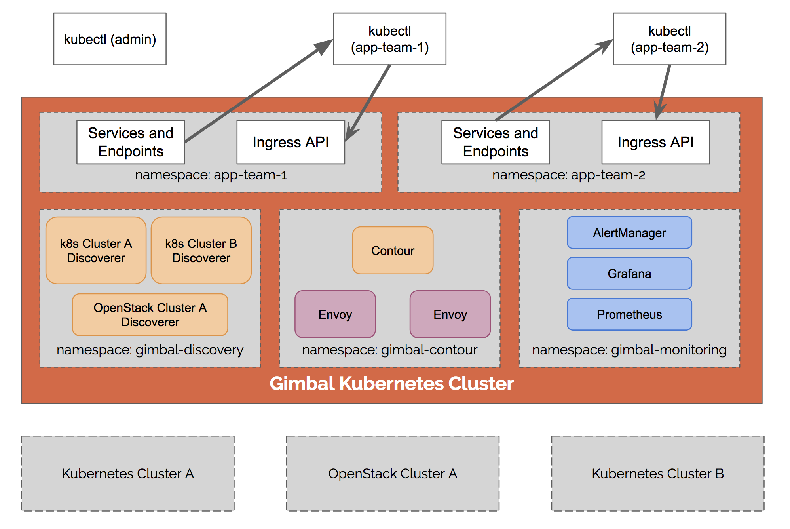
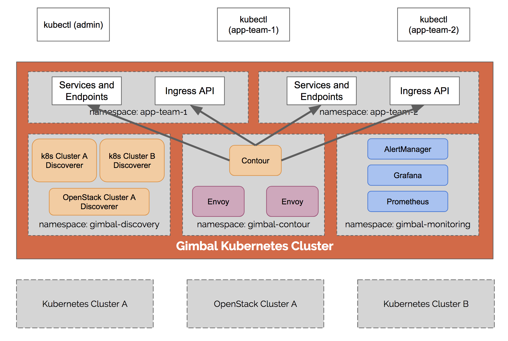
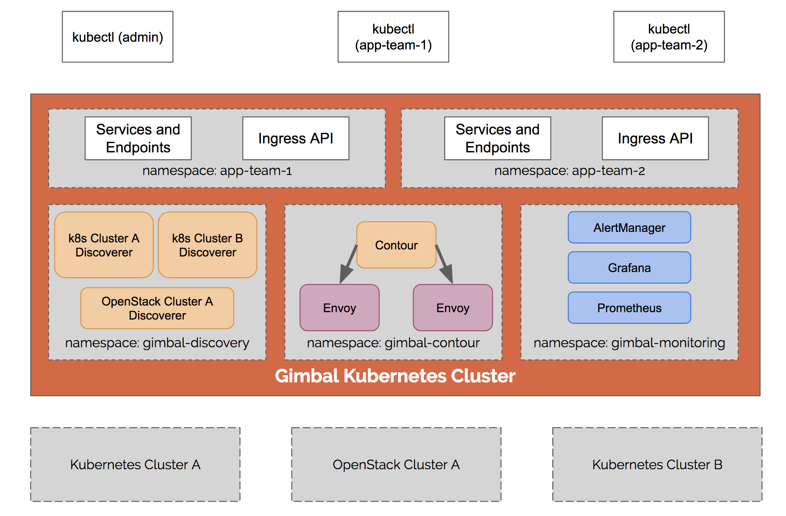

# Gimbal

Maintainers: [Heptio](https://github.com/heptio)

## Overview

Heptio Gimbal is a layer-7 load balancing platform built on Kubernetes, Envoy, and Contour.  It provides a scalable, multi-team, and API-driven ingress tier capable of routing internet traffic to multiple upstream Kubernetes clusters and traditional infrastructure technologies including OpenStack.

Gimbal was developed out of a joint effort between Heptio and Yahoo! Japan Company’s subsidiary, Actapio, to modernize Yahoo! Japan’s infrastructure with Kubernetes without impacting legacy investments in OpenStack.

At launch, Gimbal can discover services from Kubernetes and OpenStack clusters, but we expect to support additional platforms in the future.

### Common Use Cases

* Organizations with multiple Kubernetes clusters that need a way to manage ingress traffic across them
* Organizations with Kubernetes and OpenStack infrastructure that need a consistent load balancing tier
* Organizations that want to enable their development teams to safely self-manage their routing configuration
* Organizations with bare metal or on-premises infrastructure that want cloud-like load balancing capabilities

## Architecture

### High Level

Gimbal is designed to be deployed to one or more Kubernetes clusters that will act as a load balancing tier.  These load balancing clusters will then route traffic to one or more Kubernetes or OpenStack clusters.

### Gimbal Load Balancing Deployment 

Cluster administrators deploy Gimbal and its dependencies to the appropriate namespaces.

* Gimbal service discovery agents (one per upstream cluster) run in the `gimbal-discovery` namespace
* Contour and Envoy run in the `gimbal-contour` namespace
* The optional monitoring suite runs in the `gimbal-monitoring` namespace.

### Gimbal Service Discovery

Once deployed, the service discoverers continuously collect information about upstream applications running in the Kubernetes or OpenStack clusters and create corresponding `Service` and `Endpoint` objects in the appropriate team namespaces.

For example, assuming there is namespace in `Kubernetes Cluster A` called `app-team-1`, any Services and Endpoints discovered will be replicated in the Gimbal cluster within the `app-team-1` namespace.  Labels associated with the services are replicated as well.

The OpenStack discoverer provides similar behavior by monitoring all Load Balancers as a Service (LBaaS) configured as well as the corresponding Members. They are synchronized to the team's namespace as Services and Endpoints, with the namespace being configured as the TenantName in OpenStack.

### Multi-team Route Configuration

Development teams can see which Services are available to them by using standard Kubernetes tools like `kubectl`.  Services discovered by Gimbal are augmented with additional labels including the name of the cluster they were discovered which enables querying using selectors.

Developers create Kubernetes Ingress objects which define where inbound traffic (e.g. myapp.company.com) is routed.

### Contour

Contour is a Kubernetes Ingress Controller for Envoy that continuously monitors Ingress, Service, and Endpoint objects in the team namespaces.

Contour provides an Envoy API compatible GRPC endpoint which will dynamically modify the Envoy route configuration.

Envoy, deployed using the HostNetwork, provides the data plane for Gimbal.  Envoy is a high-performance load balancing proxy that physically routes ingress traffic to the upstream Kubernetes and OpenStack clusters.

### Monitoring

Gimbal includes an optional monitoring add-on that includes Prometheus, AlertManager, and Grafana.

Each Gimbal system component exposes a Prometheus-compatible /metrics route with health status and essential metrics that are aggregated by Prometheus and can be visualided using Grafana.

## Prerequisites

Gimbal is designed to run on Kubernetes clusters running version 1.9 and later.

Gimbal's service discovery is currently tested with Kubernetes 1.7+ and OpenStack Mitaka.

## Get started

Deployment of Gimbal is outlined in the [deployment section](deployment/README.md).

## Documentation

Documentation can be found in the [docs directory](docs/README.md).

## Known Limitations

* Upstream Kubernetes Pods and OpenStack VMs must be routable from the Gimbal load balancing cluster
  * No support for Kubernetes clusters with Overlay networks
  * We are looking for feedback on community requirements to design a solution. One potential option is to use one GRE tunnel per upstream cluster.  [Feedback welcome here](https://github.com/heptio/gimbal/issues/39)!
* Kubernetes Ingress API is limited and insecure
  * Only one backend per route
  * Anyone can modify route rules for a domain
  * More complex load balancing features like weighting and strategy are not supported
  * Gimbal & Contour will solve this with a [new IngressRoute CRD](https://github.com/heptio/contour/blob/master/design/ingressroute-design.md)

## Troubleshooting

If you encounter any problems that the documentation does not address, please [file an issue](https://github.com/heptio/gimbal/issues) or talk to us on the Kubernetes Slack team channel `#gimbal`.

## Contributing

Thanks for taking the time to join our community and start contributing!

Feedback and discussion is available on the [mailing list](https://groups.google.com/forum/#!forum/heptio-gimbal).

### Before you start

- Please familiarize yourself with the [Code of Conduct](CODE_OF_CONDUCT.md) before contributing.
- See [CONTRIBUTING.md](CONTRIBUTING.md) for instructions on the developer certificate of origin that we require.

### Pull Requests

- We welcome pull requests. Fee free to dig through the [issues](https://github.com/heptio/gimbal/issues) and jump in.
