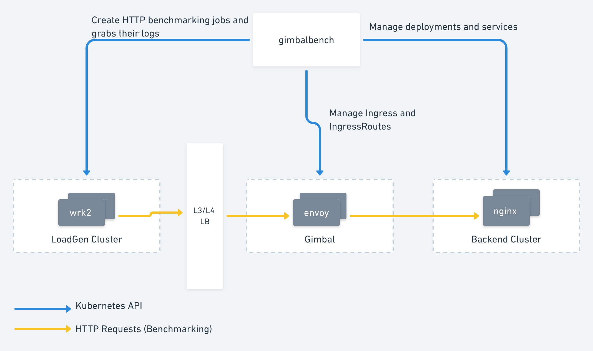

# Gimbal Performance Testing

The Gimbal performance tests run an HTTP benchmarking tool (wrk2) to obtain
performance metrics under different scenarios.

The performance tests assume that Gimbal has already been deployed, and that
there is a backend cluster that can be used for deploying services and
endpoints. In the ideal case, an additional cluster is available to run the HTTP
benchmarking tool across multiple nodes. However, if a third cluster is not available, the backend cluster can also be
used for running benchmarking jobs.

The following diagram shows the high-level architecture of the Gimbal performance tests:



At the core, each test involves the following steps:

- Create a namespace in all the clusters to run the test.
- Make changes to the backend or gimbal cluster. For example, create services in
  the backend cluster.
- Wait until the changes have taken effect. For example, wait until all services
  have been discovered.
- Create a wrk2 job on the LoadGen cluster.
- Gather wrk2 logs once the job is complete.

## Prerequisites

- Gimbal cluster: Kubernetes cluster where all the Gimbal components are
  running.
- Backend cluster: Kubernetes cluster that has a corresponding discoverer
  configured in the Gimbal cluster. Test services and endpoints will be created
  in this cluster.
- Load Generating cluster: Kubernetes cluster where wrk2 jobs will be deployed. This third cluster is recommended, but not a hard requirement, as the Backend cluster can also be used to host wrk2 jobs.
- Gimbal endpoint: L3/L4 Load Balancer that is accessible from the Load
  Generating cluster. This is the entrypoint to Gimbal.

## Available Tests

The following tests can be performed using the `gimbalbench` binary. Each test
has a corresponding flag that specifies the _test cases_ using a comma-separated
list of values.

| Name                      | Description                                                                                                                                                                                   | Flag                               |
|---------------------------|-----------------------------------------------------------------------------------------------------------------------------------------------------------------------------------------------|------------------------------------|
| Concurrent Connections    | Tests the effect of increasing the number of concurrent connections on response latency. The flag specifies the number of concurrent connections for each test case.                          | `--test-concurrent-connections`    |
| Backend Services          | Tests the effect of increasing the number of backend services on response latency. The flag specifies the number of backend services to create in the backend cluster.                        | `--test-backend-services`          |
| Backend Endpoints         | Tests the effect of increasing the number of endpoints that belong to a single backend service. The flag specifies the number of replicas that should be deployed behind the backend service. | `--test-backend-endpoints`         |
| Kubernetes Discovery Time | Measures the time it takes for the Kubernetes discoverer to discover N services. The flag specifies the number of services that should be created in the backend cluster.                     | `--test-kubernetes-discovery-time` |
| Ingress Resources         | Tests the effect of increasing the number of ingress resources that must be handled by Gimbal. The flag specifies the number of Ingress resources that should be created                      | `--test-gimbal-ingresses`          |
| IngressRoute Resources    | Tests the effect of increasing the number of ingressroute resources that must be handled by Gimbal. The flag specifies the number of IngressRoutes that should be created                     | `--test-gimbal-ingressroutes`      |

## Get Started

### Label load generating nodes

Nodes in the load generating cluster must be labeled with `workload=wrk2`. These
are the nodes that will run the wrk2 job during the tests.

### Label workload nodes in the Backend cluster

Nodes in the backend cluster must be labeled with `workload=nginx`. These are the nodes that will run nginx during the tests.

### Cluster kubeconfigs

Credentials to the clusters are provided using kubeconfig files. Currently,
three kubeconfig files must be provided, one for each cluster. The path to the
kubeconfig files is provided to the tests using the following flags:

- `--gimbal-kubecfg-file`: Path to the kubeconfig file of the gimbal cluster
- `--backend-kubecfg-file`: Path to the kubeconfig file of the backend cluster
- `--loadgen-kubecfg-file`: Path to the kubeconfig file of the loadgen cluster.
  Can be the same as `--backend-kubecfg-file`.

### Gimbal URL

The tests point wrk2 at a single URL, which is a L3/L4 load balancer that is in
front of Gimbal. The URL is provided to the test using the `--gimbal-url` flag.
For example, `http://gimbal.local`.

### Run tests

This sample command runs all available tests. It is also possible to skip tests
by not setting the corresponding flag.

```sh
gimbalbench run \
    --gimbal-kubecfg-file ${GIMBAL_KUBECONFIG} \
    --backend-kubecfg-file ${BACKEND_KUBECONFIG} \
    --loadgen-kubecfg-file ${LOADGEN_KUBECONFIG} \
    --gimbal-url ${GIMBAL_URL} \
    # Test with 250, 500, 1000 and 25000 concurrent connections
    --test-concurrent-connections 250,500,1000,2500 \
    # Test with 10, 25, 50 and 100 backend services
    --test-backend-services 10,25,50,100 \
    # Test with 10, 25, 50 and 100 endpoints behind the backend service
    --test-backend-endpoints 10,25,50,100 \
    # Test with 100, 250, 500 and 1000 services in the backend cluster
    --test-kubernetes-discovery-time 100,250,500,1000
```

### Test results

The wrk2 results are stored in the `logs` directory, inside a timestamped folder
that stores the logs for each test. This enables the tests to be run multiple
times, without destroying previous results.

### Generate test report

Gimbalbench can build a test report from a set of test results obtained in a gimbalbench run:

```sh
gimbalbench report PATH_TO_LOGS_DIR
```

This report can be stored as a CSV file, and then imported into spreadsheet software such as Google Sheets.

### Cleanup

Gimbalbench cleans up test namespaces after test runs. However, if gimbalbench
fails to delete the namespaces for whatever reason, you can use the `gimbalbench
clean` command.

```sh
$ gimbalbench clean gimbal-kubeconfig backend-kubeconfig
gimbal-kubeconfig: No gimbalbench namespaces were found in the cluster.
backend-kubeconfig: The following namespaces will be deleted:
- gimbalbench-concurrent-connections-1529699240

backend-kubeconfig: Do you want to proceed? [y/N] y
```
